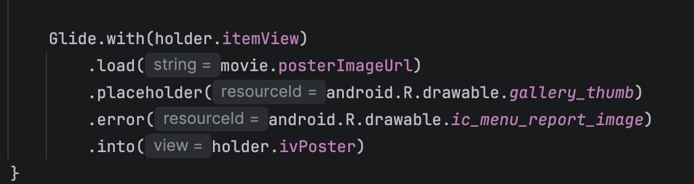

# Android Project 3 - *Project3-Moviedb*

Submitted by: **Kamran McIntosh-Ross**

**Flixster+** is a movie browsing app that allows users to browse movies currently playing in theaters. The app displays movie titles, descriptions, and poster images and supports customized layouts for both portrait and landscape orientations.

Time spent: **8 hours** spent in total

## Required Features

The following **required** functionality is completed:

- [x] **Make a request to [The Movie Database API's `now_playing`](https://developers.themoviedb.org/3/movies/get-now-playing) endpoint to get a list of current movies**
- [x] **Parse through JSON data and implement a RecyclerView to display all movies**
- [x] **Use Glide to load and display movie poster images**

The following **optional** features are implemented:

- [x] Improve and customize the user interface through styling and coloring
- [x] Implement orientation responsivity
  - App neatly arranges movie data in both landscape and portrait mode
- [x] Implement Glide to display placeholder graphics during loading
  - Note: this feature is difficult to capture in a GIF without throttling internet speeds. Instead, include an additional screencap of your Glide code implementing the feature. (<10 lines of code)
  - ### Glide Placeholder Implementation

The following code uses Glide to display a placeholder graphic while movie posters are loading:

The following **additional** features are implemented:

- [x] Added a custom purple "FlixsterPlus" app header in portrait mode
- [x] Added a custom red "Flixster: Now Playing" app header in landscape mode
- [x] Added rounded card-style backgrounds for movie listings
- [x] Customized movie title and overview text styling
- [x] Created separate portrait and landscape layouts for improved responsiveness

## Video Walkthrough

Here's a walkthrough of implemented user stories:

GIF created with **Kap**

## Notes

One challenge I encountered while building the app was creating separate layouts that displayed movie information properly in both portrait and landscape orientations. I learned how to use Android's `layout` and `layout-land` resource directories so the app automatically changes its interface when the device orientation changes.

I also customized the user interface by creating a drawable resource for the movie card backgrounds and adding different app headers for portrait and landscape modes.

## License

    Copyright 2026 Kamran McIntosh-Ross

    Licensed under the Apache License, Version 2.0 (the "License");
    you may not use this file except in compliance with the License.
    You may obtain a copy of the License at

        http://www.apache.org/licenses/LICENSE-2.0

    Unless required by applicable law or agreed to in writing, software
    distributed under the License is distributed on an "AS IS" BASIS,
    WITHOUT WARRANTIES OR CONDITIONS OF ANY KIND, either express or implied.
    See the License for the specific language governing permissions and
    limitations under the License.
